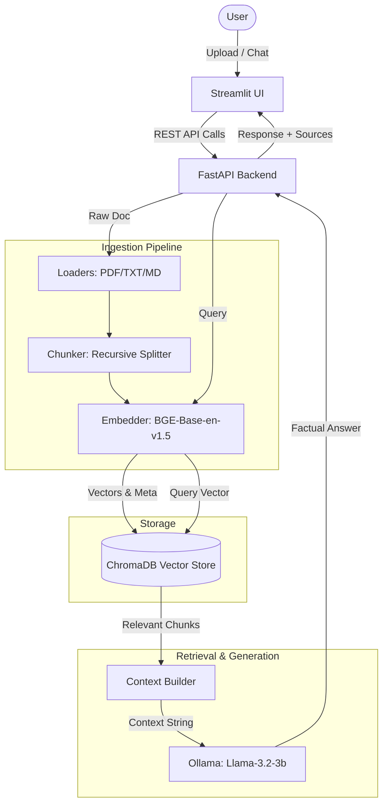

# DocuMind: Local RAG Q&A System
## Project Status Report — June 16, 2026

DocuMind is a 100% private, local Retrieval-Augmented Generation (RAG) system designed to perform secure document question-answering. It uses Apple Silicon GPU-acceleration (MPS) for embedding generation, ChromaDB for persistent vector search, and Ollama to host LLMs locally.

---

## 1. Executive Summary
As of today, the core system architecture is **fully implemented, integrated, and verified**. End-to-end functionality has been demonstrated through document ingestion, persistent vector storage, context-based prompting, local LLM generation, and a fully functional UI. 

All runner tasks (API deployment, Streamlit UI, ingestion CLI, and unit testing) have been centralized in the `Makefile` with environment-agnostic module resolution (`PYTHONPATH`).

---

## 2. Technical Architecture Overview

---

## 3. Implementation Status By Module

| Component | Target File | Status | Description |
| :--- | :--- | :--- | :--- |
| **Environment** | `requirements.txt`, `requirements-dev.txt` | **Completed** | Full PyTorch, sentence-transformers, LangChain 0.2+, FastAPI, and Streamlit stack configured under Conda. |
| **Configuration** | `configs/config.yaml`, `.env` | **Completed** | Centralized parameter config (chunk sizes, device mapping, model paths). |
| **Embeddings** | [ingestion/embedder.py](file:///Users/mayank/chatbot-retrieval/ingestion/embedder.py) | **Completed** | BAAI/bge-base-en-v1.5 wrapper with automatic Apple Silicon (MPS) GPU detection. |
| **Vector Store** | [retrieval/vector_store.py](file:///Users/mayank/chatbot-retrieval/retrieval/vector_store.py) | **Completed** | Wrapped ChromaDB client persisting data to `./data/chroma_db` using cosine distance. |
| **Ingestion Pipeline**| [ingestion/loaders.py](file:///Users/mayank/chatbot-retrieval/ingestion/loaders.py), [ingestion/chunker.py](file:///Users/mayank/chatbot-retrieval/ingestion/chunker.py) | **Completed** | Handles PyMuPDF loading, web scraping, and LangChain recursive paragraph/sentence chunking. |
| **RAG Orchestrator** | [pipeline/rag_chain.py](file:///Users/mayank/chatbot-retrieval/pipeline/rag_chain.py) | **Completed** | End-to-end controller binding retrieval steps to Ollama query execution (both single-run & token-streaming). |
| **FastAPI Backend** | [api/main.py](file:///Users/mayank/chatbot-retrieval/api/main.py) | **Completed** | Exposes upload/ingestion, chat, document deletion, and system health endpoints. |
| **Streamlit Interface**| [ui/app.py](file:///Users/mayank/chatbot-retrieval/ui/app.py) | **Completed** | User dashboard supporting document upload, document management, and chat stream rendering. |
| **Test Suite** | [tests/test_retrieval.py](file:///Users/mayank/chatbot-retrieval/tests/test_retrieval.py) | **Completed** | Pytest unit tests for dimensions, unit normalization, storage search, and context building. |

---

## 4. Verification & Testing

### A. Core Pipeline Verification
* **Test Document**: [data/raw/sample_policy.txt](file:///Users/mayank/chatbot-retrieval/data/raw/sample_policy.txt)
* **Ingestion Action**: Document successfully loaded, chunked, and stored (yielding **2 persistent chunks** in ChromaDB).
* **RAG Chat Response**:
  * **Status**: Successful.
  * **Performance**: First-run query executed in **11,336ms** (which includes loading the `llama3.2:3b` model weights into system memory).
  * **Result**: Generated answers strictly grounded in context, referencing sources and showing metadata citations inside the Streamlit UI.

### B. Bug Resolutions
1. **Conda Configuration**: Updated `~/.zshrc` to point to `/opt/miniconda3` rather than `/Users/mayank/miniconda3`.
2. **LangChain 0.2+ Import Migration**: Patched chunking module to import `RecursiveCharacterTextSplitter` from `langchain_text_splitters`.
3. **Module Resolution**: Configured all runner actions in the [Makefile](file:///Users/mayank/chatbot-retrieval/Makefile) with `PYTHONPATH=.` to prevent `ModuleNotFoundError` during standard CLI execution.

---

## 5. Next Steps & Phase 12 Roadmap
1. **Latency Optimization**:
   * Pre-load Ollama models on system startup to reduce the first-query cold-start latency.
   * Fine-tune the chunk sizes and `top_k` retrieval parameters for optimal token consumption.
2. **Cross-Encoder Re-ranking (Phase 12)**:
   * Introduce a lightweight cross-encoder (e.g., `BAAI/bge-reranker-base`) to re-score retrieved chunks before prompting the LLM, increasing factual correctness.
3. **Multi-Turn Chat History**:
   * Wire the `CONDENSE_QUESTION_PROMPT` to condense follow-up queries with previous chat contexts before sending them to the retriever.
4. **Automated Ragas Evaluation**:
   * Implement automated tests to log Faithfulness, Answer Relevance, and Context Recall metrics.
