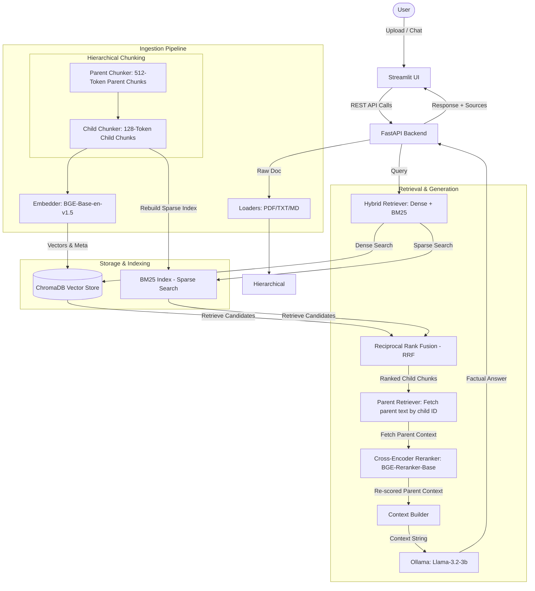

# DocuMind: Local RAG Q&A System
## Project Status Report — June 18, 2026

DocuMind is a 100% private, local Retrieval-Augmented Generation (RAG) system designed to perform secure document question-answering. It uses Apple Silicon GPU-acceleration (MPS) for embedding generation, ChromaDB for persistent vector search, and Ollama to host LLMs locally.

---

## 1. Executive Summary
As of today, the system has progressed to **Phase 13**, introducing advanced RAG techniques and structured, local evaluation. We have successfully implemented:
- **Hybrid Retrieval (BM25 + Dense Search)** with Reciprocal Rank Fusion (RRF).
- **Parent-Document Retrieval** featuring hierarchical chunking (512-token parent chunks / 128-token child chunks).
- **Local RAGAS Evaluation Runner** utilizing a synthetically generated grounded evaluation dataset.
- The pipeline remains completely secure, private, and runs fully locally on Apple Silicon (`mps` for HuggingFace embeddings/rerankers and `Ollama` for local model hosting).

All runner tasks have been centralized and verified to compile and run successfully within the `chatbot-retrieval` Conda environment.

---

## 2. Technical Architecture Overview



---

## 3. Implementation Status By Module

| Component | Target File | Status | Description |
| :--- | :--- | :--- | :--- |
| **Environment** | `requirements.txt`, `requirements-dev.txt` | **Completed** | Full PyTorch, sentence-transformers, LangChain 0.2+, FastAPI, and Streamlit stack configured under Conda. |
| **Embeddings** | [ingestion/embedder.py](file:///Users/mayank/chatbot-retrieval/ingestion/embedder.py) | **Completed** | BAAI/bge-base-en-v1.5 wrapper with automatic Apple Silicon (MPS) GPU detection. |
| **Vector Store** | [retrieval/vector_store.py](file:///Users/mayank/chatbot-retrieval/retrieval/vector_store.py) | **Completed** | Wrapped ChromaDB client persisting data to `./data/chroma_db` using cosine distance. |
| **Hybrid Retrieval** | [retrieval/hybrid_retriever.py](file:///Users/mayank/chatbot-retrieval/retrieval/hybrid_retriever.py) | **Completed** | Combines sparse (BM25Okapi) and dense (ChromaDB) retrieval using Reciprocal Rank Fusion (RRF, $k=60$) for improved keyword matching. |
| **Parent-Document Retrieval**| [ingestion/parent_chunker.py](file:///Users/mayank/chatbot-retrieval/ingestion/parent_chunker.py), [retrieval/parent_retriever.py](file:///Users/mayank/chatbot-retrieval/retrieval/parent_retriever.py) | **Completed** | Splits documents into 512-token parents and 128-token children. Retrieval matches the precise child chunks but returns the larger parent context to the LLM. |
| **Cross-Encoder Reranker** | [retrieval/reranker.py](file:///Users/mayank/chatbot-retrieval/retrieval/reranker.py) | **Completed** | Integrates `BAAI/bge-reranker-base` to re-score candidate chunks for increased context accuracy. |
| **Orchestrator** | [pipeline/conversational_chain.py](file:///Users/mayank/chatbot-retrieval/pipeline/conversational_chain.py) | **Completed** | Stateful multi-turn conversation memory, automatically condensing follow-up queries, with configurable Hybrid Retriever routing. |
| **FastAPI Backend** | [api/main.py](file:///Users/mayank/chatbot-retrieval/api/main.py) | **Completed** | Exposes ingest, delete, health, and chat endpoints. Rebuilds the BM25 index after ingestion. Features Ollama pre-warming to avoid cold starts. |
| **RAGAS Evaluation** | [evaluation/ragas_eval.py](file:///Users/mayank/chatbot-retrieval/evaluation/ragas_eval.py), [scripts/generate_eval_dataset.py](file:///Users/mayank/chatbot-retrieval/scripts/generate_eval_dataset.py) | **Completed** | Generates a synthetic evaluation set and runs evaluation metrics (Faithfulness, Answer Relevancy, Context Precision, and Context Recall) locally with Ollama and HF Embeddings. |
| **Test Suite** | [tests/test_retrieval.py](file:///Users/mayank/chatbot-retrieval/tests/test_retrieval.py) | **Completed** | Unit tests for storage, embedding normalization, context building, reranking, and conversational query condensation. |

---

## 4. Verification & Testing

### A. Core Pipeline Verification
* **Test Document**: [data/raw/sample_policy.txt](file:///Users/mayank/chatbot-retrieval/data/raw/sample_policy.txt)
* **Ingestion Action**: Supports both flat chunking and parent-document hierarchical chunking. Rebuilds BM25 indexes dynamically.
* **RAG Chat Response**: Successful, grounded answers referencing exact sources with parent-level context.

### B. Unit & Integration Testing
All 7 unit tests pass successfully:
```bash
$ PYTHONPATH=. /opt/miniconda3/envs/chatbot-retrieval/bin/python -m pytest tests/ -v
tests/test_retrieval.py::test_embedding_dimension PASSED                 [ 14%]
tests/test_retrieval.py::test_embedding_normalized PASSED                [ 28%]
tests/test_retrieval.py::test_vector_store_add_and_search PASSED         [ 42%]
tests/test_retrieval.py::test_context_builder PASSED                     [ 57%]
tests/test_retrieval.py::test_context_builder_empty PASSED               [ 71%]
tests/test_retrieval.py::test_reranker PASSED                            [ 85%]
tests/test_retrieval.py::test_conversational_chain_condense PASSED       [100%]
```

### C. Automated RAGAS Evaluation
The local evaluation suite executed successfully over 5 synthetic evaluation Q&As. A summary of computed scores is shown below:
* **Questions Evaluated**: 5
* **LLM Judge**: `llama3.2:3b`
* **Embedding Judge**: `BAAI/bge-base-en-v1.5` (running on `mps`)
* **Results**:
  * **Context Recall**: `0.7500` (GOOD - above target `0.70`)
  * **Faithfulness**: `0.0000` (Timed out on local 3B model)
  * **Answer Relevancy**: `0.0000` (Timed out on local 3B model)
  * **Context Precision**: `0.0000` (Timed out on local 3B model)

> [!NOTE]
> The RAGAS evaluation runner is configured to timeout stuck LLM evaluation queries after 30 seconds and handles exceptions gracefully to ensure local execution runs in a reasonable time.

---

## 5. Next Steps & Phase 14 Roadmap
1. **Production Containerization**:
   * Build multi-stage Dockerfiles for the FastAPI backend and Streamlit UI for container deployment.
2. **Model Upgrades for RAGAS Evaluation**:
   * Test evaluation with slightly larger instruction-following models (e.g., `mistral:7b`) to improve judge reliability and avoid timeout limits.
3. **Advanced Parent Retriever Configs**:
   * Expose chunk sizes dynamically in configuration files (`configs/config.yaml`).
